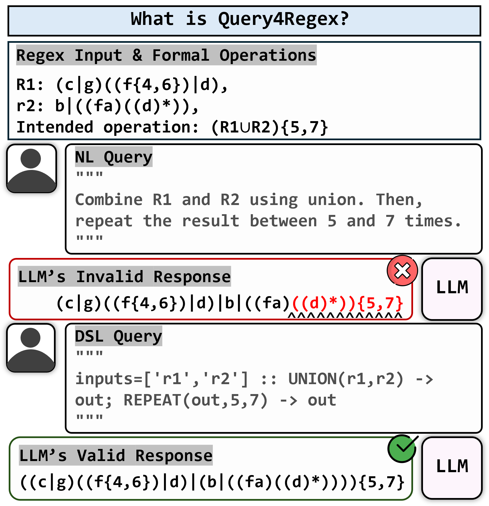

# Query4Regex: Verifiable Regex Transformation through Formal Operations from NL and DSL Queries  
**📖 Paper:** TBA | [**💾 Code**](https://github.com/peer0/Query4Regex)

## 🚀 TL;DR  

Query4Regex is a **verifiable regex transformation benchmark** for evaluating whether LLMs can manipulate **existing regular expressions** from either **natural language queries (qNL)** or a **formal DSL (qDSL)**.  
Instead of relying on string-level matching, Query4Regex verifies outputs through **deterministic finite automata (DFA) equivalence**, making correctness **formally checkable**.  
Across **1,000 benchmark instances**, formal DSL prompts consistently outperform natural language, while all models show a sharp drop as **multi-step compositional complexity** increases.

---

## 📌 About Query4Regex

### 🧐 Problem Statement  
LLMs are strong at generating structured data such as code, but **precise manipulation of existing structured objects** remains much harder.  
Regular expressions are a particularly strong testbed for this problem: they are compact, easy to get wrong, and—most importantly—the correctness of transformations can be **mathematically verified**.

**Can an LLM follow high-level transformation instructions and generate a regex that is semantically equivalent to the intended target?**

> 
> _Overview of the Query4Regex task_

### 💡 Our Approach  
Query4Regex studies this question through three key design choices:
1. **Verifiable transformation task**: Given source regexes and a transformation query, generate the correct target regex.
2. **Dual query formats**: Evaluate both **natural language queries (qNL)** and **formal DSL queries (qDSL)** that describe the same transformation.
3. **Formal verification**: Measure correctness using both **syntactic parsability** and **DFA-based semantic equivalence**.

---

## 🛠 How It Works

### 🔹 Task Definition  
Each benchmark instance provides one or more **source regexes** and a **transformation query**.  
The model must generate a new regex that is **semantically equivalent** to applying the specified operations to the source regexes.

### 🔹 Supported Formal Operations  
Query4Regex focuses on classical regular-language operations:
- **Union**
- **Intersection**
- **Concatenation**
- **Complement**
- **Kleene Star**
- **Bounded Repetition**

This keeps the task inside the space of **regular languages**, enabling **exact DFA-equivalence verification**.

### 🔹 Dataset Construction  
The benchmark is built through a controlled generation pipeline:
1. Generate simple **atomic seed regexes**.
2. Randomly sample **1 to 3 formal operations** and apply them to create the target regex.
3. Convert the same transformation into:
   - a **natural language instruction (qNL)**, or
   - a **formal DSL program (qDSL)**.

### 🔹 Two Query Scenarios  
- **qNL**: Human-like instructions that may contain ambiguity such as *“the result”* or *“it”*.
- **qDSL**: A machine-parsable procedural format that explicitly defines **inputs**, **operation order**, and **intermediate variables**.

### 🔹 Example Query Pair  

**Natural Language (qNL)**  
> Take `r1` and concatenate it with `r2`, then apply the Kleene star to the whole result.

**Formal DSL (qDSL)**  
```text
inputs=['r1','r2'] :: CONCAT(r1,r2) -> o1; STAR(o1) -> out
```

### 🔹 Evaluation Metrics  
- **Syntactic Correctness (Syn.)**: Whether the output is a valid parsable regex.
- **Semantic Equivalence (Sem.)**: Whether the output accepts exactly the same language as the target regex.
- **Sem.†**: Semantic equivalence measured only on syntactically valid outputs.

---

## 🧪 Benchmark Overview

| Property | Value |
|---------|-------|
| Total instances | **1,000** |
| Query formats | **qNL, qDSL** |
| Prompt settings | **Zero-shot, Five-shot** |
| Operations per instance | **1 to 3** |
| Verification | **Regex parsing + DFA equivalence** |

### 📊 Distribution by Compositional Complexity

| # of Operations | Instances | Percentage |
|----------------|-----------|------------|
| **1** | 671 | 67.1% |
| **2** | 182 | 18.2% |
| **3** | 147 | 14.7% |

---

## 🏆 Main Findings

### ✅ Key Takeaways
- **Formal DSL significantly outperforms natural language** for regex transformation.
- The benchmark reports **up to 6.74%p average gains** from using DSL instead of natural language.
- The benefit is especially strong for **reasoning-oriented LLMs**.
- **Performance collapses as compositional complexity increases**, revealing a major weakness in multi-step symbolic reasoning.
- Many failures are **syntactic**, not just semantic, which makes **formal verification essential**.

### 📌 Overall Performance (Five-shot)

| Model | qNL Sem. | qNL Sem.† | qDSL Sem. | qDSL Sem.† |
|------|----------|-----------|-----------|------------|
| **Phi-4 (14B)** | 21.2 | 47.53 | 18.0 | 40.63 |
| **gemma-3 (27B)** | 23.1 | 50.22 | 20.2 | 45.50 |
| **Llama-3.3 (70B)** | 19.4 | 44.60 | 21.1 | 48.62 |
| **Phi-4-reasoning (14B)** | 17.38 | 51.24 | **29.2** | **63.34** |
| **gpt-oss (20B)** | 19.76 | 42.04 | 28.2 | 60.13 |
| **gpt-oss (120B)** | 16.4 | 36.20 | 28.3 | 62.47 |

> **Observations**
> - qDSL yields the strongest improvements for reasoning models.
> - **Phi-4-reasoning (14B)** achieves the best overall semantic equivalence in the five-shot qDSL setting.
> - Syntactic validity alone is not enough; semantic verification remains the real challenge.

### 📉 Error Analysis in the Best Setting (qDSL, Five-shot)

| Error Type | Phi-4-reasoning (14B) | gpt-oss (120B) |
|-----------|------------------------|----------------|
| **Correct** | 292 | 283 |
| **Unparsable (Syntax)** | 539 | 547 |
| **Semantic Error** | 169 | 170 |

> **Common failure modes**
> - **Scope leakage** in multi-step instructions
> - **Partial correctness**, where the model ignores the final operation in a transformation chain

---

## ⚙️ Installation

### 🔧 Environment  
The paper reports the following experimental environment:

- **OS**: Rocky Linux 9.6
- **Python**: 3.11
- **PyTorch**: 2.8.0
- **Transformers**: 4.56.2
- **Accelerate**: 1.10.1
- **BitsAndBytes**: 0.47.0
- **Pyformlang**: 1.0.10

```bash
git clone https://github.com/peer0/Query4Regex.git
cd Query4Regex

python3.11 -m venv .venv
source .venv/bin/activate

pip install torch==2.8.0 \
            transformers==4.56.2 \
            accelerate==1.10.1 \
            bitsandbytes==0.47.0 \
            pyformlang==1.0.10
```

---

## 🖥 Experimental Setup

### Hardware
- **NVIDIA A6000** for small-to-medium models
- **NVIDIA RTX PRO 6000 Blackwell** for the largest models

### Decoding
- **Deterministic greedy decoding** for reproducibility

---

## 🔍 Evaluation Protocol

A standard Query4Regex evaluation workflow is:

1. **Prepare source regexes and transformation queries**
   - Use either **qNL** or **qDSL**.
2. **Run the model in zero-shot or five-shot mode**
   - Five-shot prompts use an auxiliary example pool disjoint from the 1,000 evaluation instances.
3. **Check syntactic validity**
   - Measure whether the predicted output is a valid regex.
4. **Verify semantic correctness**
   - Convert both the prediction and target into DFAs.
   - Check **DFA equivalence** rather than raw string matching.

---

## 🧠 Why Query4Regex Matters

Query4Regex is not a standard regex-generation benchmark.  
It specifically evaluates whether LLMs can **follow compositional transformation instructions** over an existing formal object and remain correct at the **semantic level**.

This makes Query4Regex a strong benchmark for studying the gap between:
- **linguistic fluency**, and
- **symbolic / procedural reasoning**

in modern language models.

---

## 🔬 Limitations and Future Directions

- The current benchmark is limited to **classical regular-expression operators**.
- More practical regex features such as **lookarounds** and **backreferences** are currently out of scope.
- The current release contains **1,000 instances** with up to **3 operations**.
- Future work will extend the benchmark with **more complex regex features** and harder compositional settings.

---

## 📚 Citation

If you use this repository, please cite the Query4Regex paper.

```bibtex
@article{HahnH26,
  title={{Query4Regex}: Verifiable Regex Transformation through Formal Operations from NL and DSL Queries},
  author={Joonghyuk Hahn and Yo-Sub Han},
  booktitle={Proceedings of the 2026 Conference of the European Chapter of the Association for Computational Linguistics, {EACL}},
  year={2026},
  url={To be updated.}
}
```
